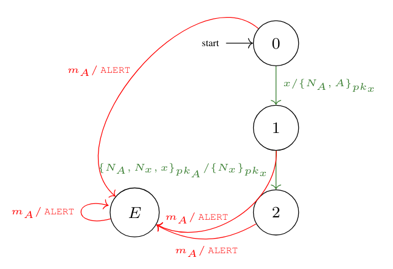

ProInspector: Uncovering Logical Bugs in Protocol Implementations
========================================
# About 
ProInspector is a tool for conformance testing of protocol implementations against a reference symbolic state machine representation. The reference state machine can be articulated either in the `.DOT` format or in ProInspector's domain-specific language (refer to `/src/proinspector/examples/` for examples). ProInspector relies on a parameterized [Dolev-Yao](https://en.wikipedia.org/wiki/Dolev%E2%80%93Yao_model) attacker to generate symbolic test cases containing malformed messages. The generated test cases consist of input and expected output pairs (upcoming support for JSON formatting), facilitating seamless integration into any testing infrastructure.

# Installation
Ensure you have Python 3 installed on your system. Additionally, install the required packages listed in `requirements.txt` by running `pip install -r requirements.txt`.

# Sample Usage
The script `nsl_client.py` located in `src/proinspector/examples/` generates test cases for Alice in the Needham–Schroeder-Lowe protocol based on the provided reference state machine:


Running `python3 src/proinspector/examples/nsl_client.py` in the terminal generate the test cases below:
```
Trace#0
i[0]:'A'
o[0]:ErrM/Alert
Trace#1
i[0]:AEnc{Nonce('A'),Nonce('A'),'A'}_PKey('M')
o[0]:ErrM/Alert
Trace#2
i[0]:AEnc{Nonce('A'),Nonce('A'),'B'}_PKey('M')
o[0]:ErrM/Alert
Trace#3
i[0]:AEnc{Nonce('A'),Nonce('A'),'M'}_PKey('M')
o[0]:ErrM/Alert
Trace#4
i[0]:AEnc{Nonce('A'),Nonce('M'),'A'}_PKey('M')
o[0]:ErrM/Alert
Trace#5
i[0]:AEnc{Nonce('A'),Nonce('M'),'B'}_PKey('M')
o[0]:ErrM/Alert
Trace#6
i[0]:AEnc{Nonce('A'),Nonce('M'),'M'}_PKey('M')
o[0]:ErrM/Alert
Trace#7
i[0]:AEnc{Nonce('M'),Nonce('A'),'A'}_PKey('M')
o[0]:ErrM/Alert
Trace#8
i[0]:AEnc{Nonce('M'),Nonce('A'),'B'}_PKey('M')
o[0]:ErrM/Alert
Trace#9
i[0]:AEnc{Nonce('M'),Nonce('A'),'M'}_PKey('M')
o[0]:ErrM/Alert
Trace#10
i[0]:AEnc{Nonce('M'),Nonce('M'),'A'}_PKey('M')
o[0]:ErrM/Alert
Trace#11
i[0]:AEnc{Nonce('M'),Nonce('M'),'B'}_PKey('M')
o[0]:ErrM/Alert
Trace#12
i[0]:AEnc{Nonce('M'),Nonce('M'),'M'}_PKey('M')
o[0]:ErrM/Alert
Trace#13
i[0]:'B'
o[0]:AEnc{Nonce('A'),'A'}_PKey('B')
i[1]:'B'
o[1]:ErrM/Alert
Trace#14
i[0]:'B'
o[0]:AEnc{Nonce('A'),'A'}_PKey('B')
i[1]:'M'
o[1]:ErrM/Alert
Trace#15
i[0]:'B'
o[0]:AEnc{Nonce('A'),'A'}_PKey('B')
i[1]:AEnc{Nonce('M'),Nonce('M'),'B'}_PKey('M')
o[1]:ErrM/Alert
Trace#16
i[0]:'B'
o[0]:AEnc{Nonce('A'),'A'}_PKey('B')
i[1]:AEnc{Nonce('M'),Nonce('M'),'M'}_PKey('M')
o[1]:ErrM/Alert
...
```
# ProInspector Framework
The ProInspector Framework utilizes the ProInspector for conducting conformance testing of protocol implementations by connecting a symbolic protocol prover (e.g., [ProVerif](https://prosecco.gforge.inria.fr/personal/bblanche/proverif/). It verifies whether non-conforming traces could potentially lead to real attacks (for further details, refer to our [publication]()). Our case study on the [TLS 1.3](https://wiki.openssl.org/index.php/TLS1.3) protocol is located in `src/proinspector/protocols/TLS/`.

# Acknowledgements
ProInspector incorporate the conformance testing module from [pylstar](https://github.com/gbossert/pylstar).
# Documents/Publications
```
@inproceedings{proinspector-eurosp2024,
  title =        {ProInspector: Uncovering Logical Bugs in Protocol Implementations},
  author =       {Zichao Zhang and Limin Jia and Corina Pasareanu},
  booktitle =    {Proceedings of the IEEE European Symposium on Security and Privacy (Euro S&P)},
  month =        jul,
  year =         2024,
  xurl =          {https://www.andrew.cmu.edu/user/liminjia/research/papers/proinspector-eurosp24.pdf},
  xdoi = {10.1109/EuroSP57164.2023.00068},
  topic = {sec,fm},
}
```